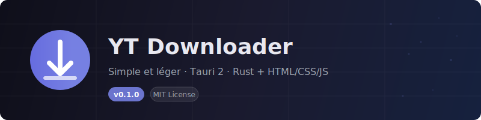

<p align="center">
  
</p>

<p align="center">
  <a href="#fonctionnalités">Fonctionnalités</a> ·
  <a href="#prérequis">Prérequis</a> ·
  <a href="#installation">Installation</a> ·
  <a href="#utilisation">Utilisation</a> ·
  <a href="#build-multi-plateforme">Build</a> ·
  <a href="#structure-du-projet">Structure</a> ·
  <a href="#contribuer">Contribuer</a> ·
  <a href="#licence">Licence</a>
</p>

<p align="center">
  
  
  
  
  
</p>

---

## YouTube Downloader

Application de bureau moderne et légère pour télécharger des vidéos YouTube. Construite avec **Tauri 2** (backend Rust + frontend HTML/CSS/JS), elle offre une expérience fluide, un design premium glassmorphism et un support bilingue FR/EN.

> **Landing page :** [yt-downloader-docs.vercel.app](https://yt-downloader-docs.vercel.app)
> **Auteur :** Koffi Levis Akalete · [koffilevis21@gmail.com](mailto:koffilevis21@gmail.com)

---

## Fonctionnalités

### Recherche & Aperçu
- **Recherche YouTube** par mot-clé (jusqu'à 100 résultats)
- **Recherche par URL** (vidéo ou playlist)
- **Aperçu vidéo** avec lecteur YouTube intégré (modal redimensionnable/déplaçable)
- **Tri** : pertinence, nom, durée, taille
- **Vue carte** ou **vue liste**
- **Auto-paste** : un lien collé lance automatiquement la recherche

### Téléchargement
- **File d'attente** avec téléchargements simultanés (1 à 5 configurable)
- **yt-dlp intégré** (sidecar) — aucune dépendance externe requise
- **Choix de qualité** : Meilleure qualité, 1080p, 720p, 480p, 360p, Audio MP3
- **Pause / Reprise / Annulation** de chaque téléchargement
- **Barre de progression** en temps réel sur chaque carte
- **Taille du fichier** affichée avant téléchargement

### Interface iOS-like
- **Design glassmorphism** premium avec backdrop-filter blur
- **Dark mode true black** (#000) avec primary blue #007aff
- **Spring animations** (cubic-bezier 0.175, 0.885, 0.32, 1.275)
- **SF Pro font** system, 0.5px Apple-style borders
- **Bilingue FR/EN** avec 80+ traductions
- **Responsive** : 4 colonnes → 3 → 2 → 1 selon la taille
- **Pagination** (32 résultats par page)

### Productivité
- **Drag & Drop** : glisse un lien YouTube n'importe où dans l'app
- **Historique** des téléchargements (localStorage, max 100)
- **Paramètres** unifiés : thème, langue, concurrence, dossier
- **Raccourcis clavier** : `Ctrl+K` focus search, `Esc` fermer modals

### Contact & Support
- **Formulaire de contact** intégré (envoi via Vercel SMTP)
- **Page contact** sur le site landing
- **Lien GitHub** pour les contributeurs

---

## Prérequis

| Outil | Version minimale | Lien d'installation |
|-------|------------------|---------------------|
| **Rust** | 1.70+ | [rust-lang.org](https://www.rust-lang.org/tools/install) |
| **Node.js** | 18+ | [nodejs.org](https://nodejs.org/) |
| **npm** | 9+ | Inclus avec Node.js |

> **Note :** yt-dlp est maintenant intégré automatiquement dans l'application (sidecar). Aucune installation externe n'est requise.

### Dépendances système (Linux)

```bash
# Debian / Ubuntu
sudo apt install libwebkit2gtk-4.1-dev libgtk-3-dev libayatana-appindicator3-dev librsvg2-dev

# Arch
sudo pacman -S webkit2gtk-4.1 gtk3 libappindicator-gtk3 librsvg

# Fedora
sudo dnf install webkit2gtk4.1-devel gtk3-devel libappindicator-gtk3-devel librsvg2-devel
```

---

## Installation

```bash
# Cloner le repository
git clone https://github.com/akaletekoffilevis/youtube-downloader.git
cd youtube-downloader

# Installer les dépendances Node.js
npm install

# Télécharger yt-dlp sidecar (pour dev local)
bash download-ytdlp.sh
```

---

## Utilisation

```bash
# Mode développement (hot reload)
npm run dev

# Build release (compile + optimise)
npm run build

# Lancer le binaire compilé
./src-tauri/target/release/youtube-downloader
```

### Raccourcis clavier

| Raccourci | Action |
|-----------|--------|
| `Entrée` | Lancer la recherche |
| `Ctrl+K` | Focus barre de recherche |
| `Échap` | Fermer les modals/file d'attente |

---

## Build Multi-plateforme

### Windows

```bash
npm run build
# Outputs dans src-tauri/target/release/bundle/
# - NSIS installer (.exe)
# - MSI installer
```

### Linux

```bash
npm run build
# Outputs :
# - .deb (Debian/Ubuntu)
# - .AppImage (universel)
# - .rpm (Fedora) [si rpm-build installé]
```

### macOS

```bash
npm run build
# Outputs :
# - .app (application macOS)
# - .dmg (disque d'installation)
# Nécessite un build macOS (cross-compilation non supportée)
```

### CI/CD

- **`build.yml`** — Déclenché par tag `v*`, build Linux/Windows/macOS avec yt-dlp sidecar, upload sur GitHub Releases
- **`ci.yml`** — Déclenché par push sur `dev` ou PR vers `main`, build de vérification sans release

---

## Structure du Projet

```
youtube-downloader/
├── src/                          # Frontend (HTML/CSS/JS)
│   ├── index.html                # Point d'entrée HTML
│   ├── styles.css                # Styles CSS (iOS-like, thèmes light/dark)
│   ├── main.js                   # Logique applicative
│   ├── i18n.js                   # Système de traduction FR/EN (80+ clés)
│   ├── mock.js                   # Données simulées pour preview navigateur
│   └── assets/
│       └── fontawesome/          # Icônes Font Awesome 7
├── src-tauri/                    # Backend Rust (Tauri 2)
│   ├── src/
│   │   └── lib.rs                # Commands Tauri (search, download, network...)
│   ├── Cargo.toml                # Dépendances Rust
│   ├── tauri.conf.json           # Configuration Tauri (window, bundle, security)
│   ├── binaries/                 # yt-dlp sidecar (gitignored)
│   └── icons/                    # Icônes de l'application (PNG, ICO, ICNS)
├── docs/                         # Documentation & assets
│   ├── logo.svg                  # Logo de l'application
│   └── banner.svg                # Banner README
├── .github/workflows/
│   ├── build.yml                 # CI/CD release (tag v*)
│   └── ci.yml                    # CI check (dev/PR)
├── download-ytdlp.sh             # Script pour télécharger yt-dlp en dev
├── package.json                  # Configuration npm
├── .gitignore                    # Fichiers ignorés par Git
└── README.md                     # Ce fichier
```

---

## Architecture Technique

### Frontend (`src/`)
- **HTML5** — Structure sémantique
- **CSS3** — Variables CSS, glassmorphism, dark mode true black, spring animations, responsive grid
- **JavaScript vanilla** — DOM manipulation, async/await, localStorage, drag & drop API
- **Font Awesome 7** — Icônes

### Backend Rust (`src-tauri/`)
- **Tauri 2** — Framework de bureau Rust
- **yt-dlp** — Extraction et téléchargement YouTube (sidecar binaire)
- **tokio** — Runtime async pour les opérations bloquantes
- **serde** — Sérialisation/désérialisation JSON

### IPC (Frontend ↔ Backend)
Les communications entre le frontend et le backend utilisent le système d'**invoke** de Tauri :

| Commande | Description |
|----------|-------------|
| `search_videos` | Recherche YouTube (ytsearch100 + flat-playlist) |
| `get_video_info` | Infos détaillées d'une vidéo |
| `get_playlist` | Vidéos d'une playlist |
| `download_video` | Lance un téléchargement |
| `pause_download` | Met en pause (SIGSTOP) |
| `resume_download` | Reprend (SIGCONT) |
| `cancel_download` | Annule le processus |
| `check_network` | Vérifie la connectivité |
| `pick_folder` | Sélecteur de dossier natif |
| `check_dir_exists` | Vérifie l'existence d'un dossier |
| `get_file_size` | Récupère la taille du fichier |
| `open_in_browser` | Ouvre une URL dans le navigateur |

---

## Configuration

### Thème
Le thème est sauvegardé dans `localStorage` (`ytdl-theme`). Deux options :
- **Light** (défaut) — Fond clair, glassmorphism blanc
- **Dark** — Fond true black (#000), primary blue #0a84ff

### Langue
La langue est sauvegardée dans `localStorage` (`ytdl-lang`). Deux options :
- **FR** (défaut)
- **EN**

### Dossier de téléchargement
Le dossier est sauvegardé dans `localStorage` (`ytdl-dir`). Par défaut : `~/Downloads/YoutubeDownloader`.

### Téléchargements simultanés
Configurable de 1 à 5 via le modal Paramètres, sauvegardé dans `localStorage` (`ytdl-max-dl`).

### Historique
Sauvegardé dans `localStorage` (`ytdl-history`), max 100 entrées.

---

## Changelog

### v0.2.0 — 14 Juillet 2026
- **yt-dlp intégré** (sidecar) — aucune dépendance externe
- **Refonte UI** : design iOS-like, dark mode true black, spring animations
- **Drag & Drop** : glisser un lien YouTube pour lancer la recherche
- **Historique** des téléchargements (localStorage)
- **Paramètres unifiés** : thème, langue, concurrence, dossier
- **Raccourcis clavier** : Ctrl+K, Esc
- **Landing page** refondue avec Tailwind CSS (6 pages, FR/EN)
- **Formulaire contact** via Vercel SMTP
- **Liens de téléchargement** directs depuis GitHub Releases
- **CI/CD** : build release Linux/Windows/macOS + CI check dev/PR
- **Fix** deadlock progress: stdout drainé séparément
- **Cleanup** : suppression des doublons UI (dl manager, topbar theme/lang, dl-limit)

### v0.1.0 — 13 Juillet 2026
- Première release publique
- Recherche YouTube intégrée (ytsearch100)
- Téléchargement avec barre de progression
- File d'attente (1-5 simultanés)
- Choix de qualité : 1080p, 720p, 480p, 360p, MP3
- Thème clair & sombre (glassmorphism)
- Interface bilingue FR/EN
- Sélection de dossier natif
- Contact support (Web3Forms)
- Build Windows, Linux, macOS via GitHub Actions

---

## Contribuer

Les contributions sont les bienvenues !

1. **Fork** le repository
2. **Créer** une branche pour ta feature (`git checkout -b feature/nom-feature`)
3. **Commit** tes changements (`git commit -m 'feat: ajout de la feature'`)
4. **Push** vers la branche (`git push origin feature/nom-feature`)
5. **Ouvrir** une Pull Request

### Convention de commits

On suit les [Conventional Commits](https://www.conventionalcommits.org/) :

| Préfixe | Usage |
|---------|-------|
| `feat:` | Nouvelle fonctionnalité |
| `fix:` | Correction de bug |
| `docs:` | Documentation |
| `style:` | Changement de style (pas de code) |
| `refactor:` | Refactorisation du code |
| `chore:` | Tâches de maintenance |

### Signaler un bug

Utilise le [formulaire de contact](https://yt-downloader-docs.vercel.app/contact.html) ou le formulaire intégré dans l'application.

---

## Licence

Ce projet est sous licence **MIT**. Tu peux l'utiliser, le modifier et le redistribuer librement.

```
MIT License

Copyright (c) 2026 Koffi Levis Akalete

Permission is hereby granted, free of charge, to any person obtaining a copy
of this software and associated documentation files (the "Software"), to deal
in the Software without restriction, including without limitation the rights
to use, copy, modify, merge, publish, distribute, sublicense, and/or sell
copies of the Software, and to permit persons to whom the Software is
furnished to do so, subject to the following conditions:

The above copyright notice and this permission notice shall be included in all
copies or substantial portions of the Software.

THE SOFTWARE IS PROVIDED "AS IS", WITHOUT WARRANTY OF ANY KIND, EXPRESS OR
IMPLIED, INCLUDING BUT NOT LIMITED TO THE WARRANTIES OF MERCHANTABILITY,
FITNESS FOR A PARTICULAR PURPOSE AND NONINFRINGEMENT. IN NO EVENT SHALL THE
AUTHORS OR COPYRIGHT HOLDERS BE LIABLE FOR ANY CLAIM, DAMAGES OR OTHER
LIABILITY, WHETHER IN AN ACTION OF CONTRACT, TORT OR OTHERWISE, ARISING FROM,
OUT OF OR IN CONNECTION WITH THE SOFTWARE OR THE USE OR OTHER DEALINGS IN THE
SOFTWARE.
```

---

## Auteur

**Koffi Levis Akalete**
- Email : [koffilevis21@gmail.com](mailto:koffilevis21@gmail.com)
- GitHub : [@akaletekoffilevis](https://github.com/akaletekoffilevis)

---

<p align="center">
  Made with ❤️ by Koffi Levis Akalete · © 2026 All Rights Reserved
</p>
